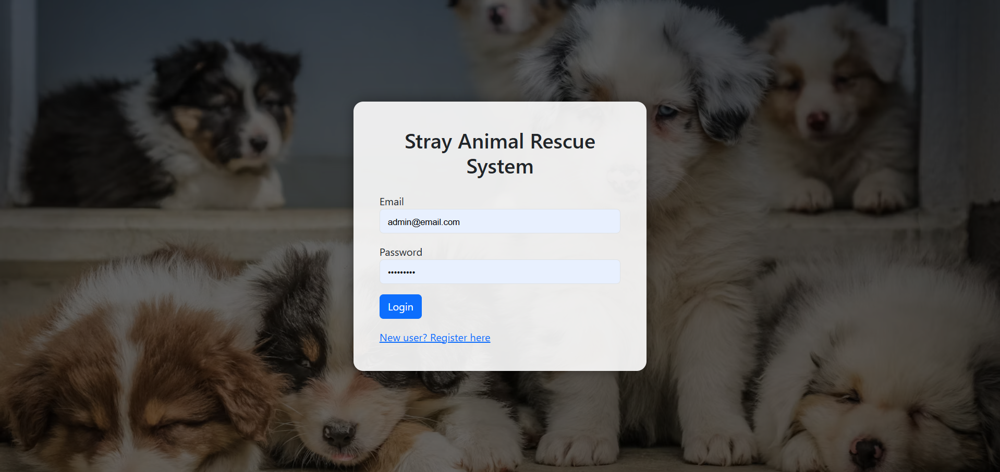
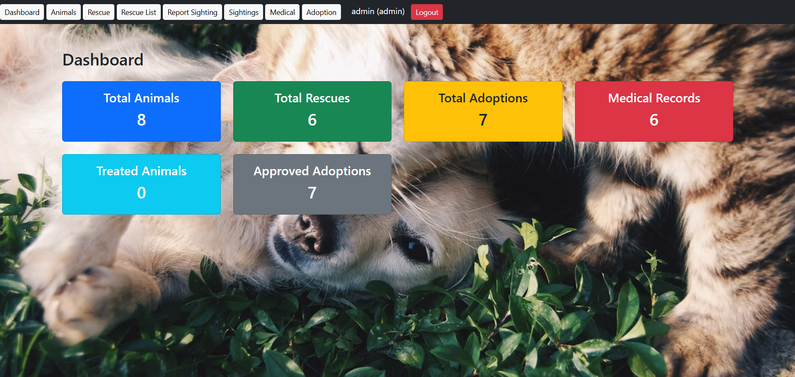
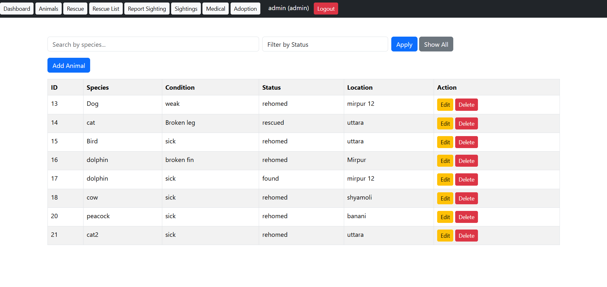
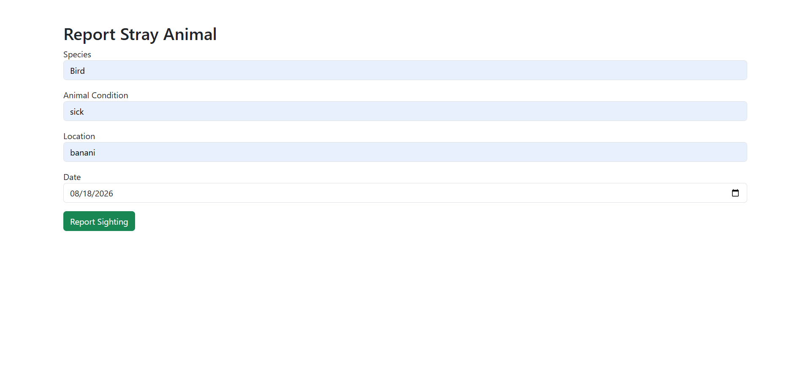
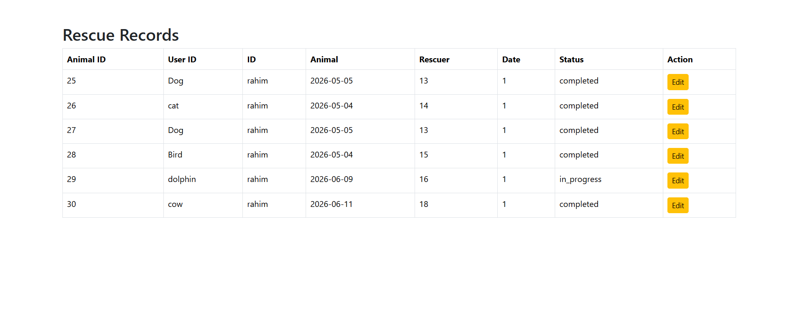
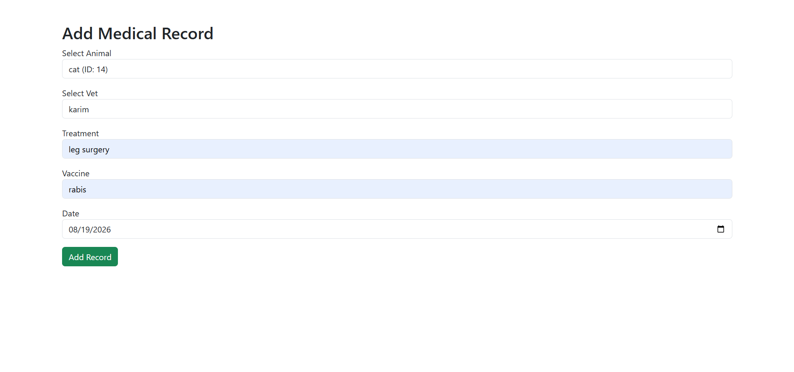
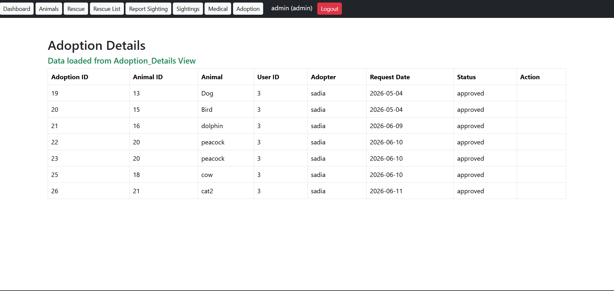

# 🐾 Stray Animal Rescue & Adoption Management System

A full-stack web application built with PHP, MySQL, and Bootstrap 5 to manage the complete lifecycle of stray animals — from sighting and rescue to medical treatment and adoption.

## 📸 Screenshots

### Login

###  Dashboard

###  Animal Management

###  Sightings & Admin Approval

###  Rescue Management

###  Medical Records

###  Adoption Management

## Features

- Role-based authentication for Admin, Rescuer, Veterinarian, and Adopter
- Stray animal sighting and admin approval workflow
- Animal management with CRUD operations
- Rescue tracking and status management
- Medical record management
- Adoption request and approval system
- Search and filtering
- Dashboard statistics
- SQL JOINs and aggregate functions
- Database constraints and relational design

##  Tech Stack

- PHP
- MySQL
- HTML5
- CSS3
- Bootstrap 5
- Apache / XAMPP
- phpMyAdmin

##  System Workflow

Sighting → Admin Review → Animal Added → Rescue → Medical Treatment → Adoption → Rehoming

##  Project Objective

The system provides an organized platform for managing stray animal rescue operations while demonstrating practical full-stack development and database management concepts.
